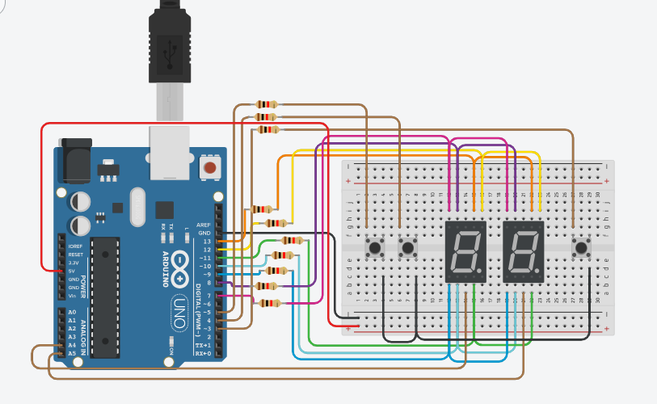

# :zap: Sistemas de Procesamiento Datos :zap:

## :cat: Integrantes
- Pardo Agustina
- Sassone Irina

## :cat: Proyecto: Contador (0-99) con Display 7 Segmentos y Multiplexación

## :cat: Descripcion:

## :cat: Funcion principal:

## :cat: Link al proyecto:
[Tinkercad](https://www.tinkercad.com/things/lNDwfBnh4Jw)

